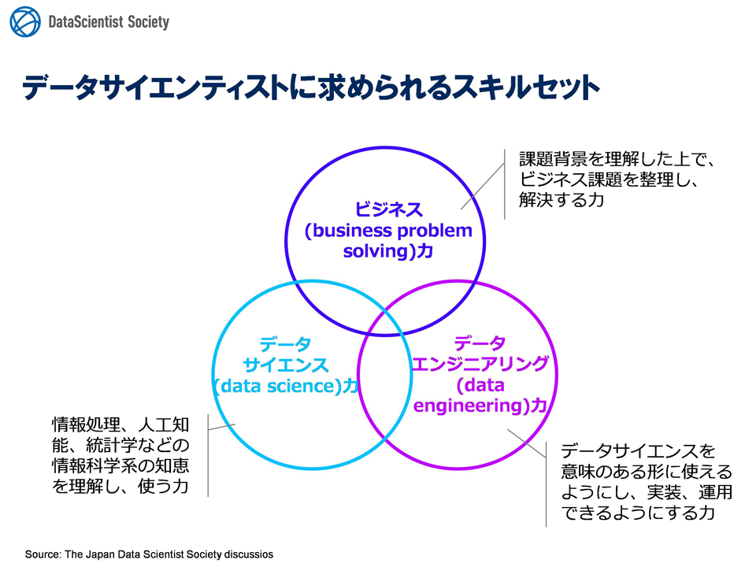

.. toctree::
   :maxdepth: 4

オリエンテーション
=================================

データサイエンスとは
-----------------------------

データサイエンス(data science)とは、データを用いて新たな ``科学的および社会に有益な知見を引き出そうとするアプローチ`` のことであり、
その中でデータを扱う手法である **情報科学** 、 **統計学** 、 **アルゴリズム** などを横断的に扱う。

詳しくは、 Wikipedia_ を参照

要求されるスキル
------------------------------------
データサイエンティストに必要なスキルは以下である。

- ビジネス解決スキル
    | 課題背景を理解したうえで、ビジネス 課題を整理し、解決する力
- データサイエンススキル
    | 情報処理、人工知能、統計学などの情報 科学系の知恵を理解し、使う力
- データエンジニアリングスキル
    | データサイエンスを意味のある 形に使えるようにし、実装、運用できるようにする力

https://itjinzai-lab.jp/article/detail/314  
http://www.datascientist.or.jp/dssjournal/  

ここでは、**データサイエンスのスキル** の基礎を提供する。

データサイエンス スキル
------------------------------
上記の定義より、データサイエンス スキルの要素は以下である。

- 情報処理スキル
- 人工知能関連知識
- 統計解析スキル

機械学習とは
--------------------------
機械学習については下記リンクで説明する。
    https://daring-board.github.io/clustering_practice/index.html

.. _Wikipedia: https://ja.wikipedia.org/wiki/%E3%83%87%E3%83%BC%E3%82%BF%E3%82%B5%E3%82%A4%E3%82%A8%E3%83%B3%E3%82%B9

* :ref:`genindex`
* :ref:`modindex`
* :ref:`search`
